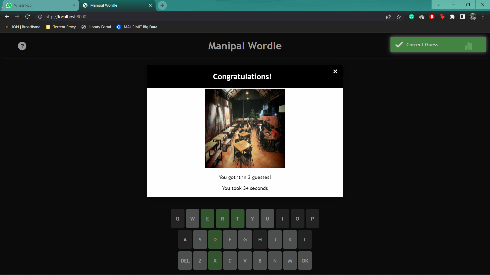

# Manipal-Themed Wordle

## Project Information
**Lab:** Internet Tool and Technology Lab  
**Semester:** VI Sem B.Tech  

**Team Members:**  
- **Arnaav Anand** (Team Lead)  
- Tanay Jha  
- Ankush Nath  
- Nalin Bhargava  

---

## Abstract
This project is a thematic adaptation of the popular word-guessing game **Wordle**, customized for the Manipal campus community.  
The game uses a curated dictionary containing names of well-known locations in and around Manipal, allowing students to engage with a familiar and localized version of Wordle.

Players are tasked with guessing the secret word within a fixed number of attempts. After each guess, the system provides visual feedback:
- **Green tiles** indicate letters that are correct and in the correct position.
- **Yellow tiles** indicate letters that exist in the secret word but are in the wrong position.
- **Grey tiles** indicate letters not present in the secret word at all.

The game continues until the player either correctly guesses the word or runs out of attempts.  
This project is intended to provide entertainment while promoting familiarity with places around campus, fostering a sense of community.

---

## Introduction
Wordle gained worldwide popularity in 2022 due to its simple mechanics and daily challenge format. Since its rise, numerous themed versions have been created, targeting specific interests, communities, or topics.

This project extends that trend by creating a **campus-exclusive version** for Manipal students, replacing Wordle's general vocabulary with a list of campus-related locations. The adaptation blends entertainment with local familiarity, offering:
- A unique challenge for those who know the area.
- A way for new students to learn about significant campus locations.
- An opportunity for alumni to recall familiar places with a sense of nostalgia.

This version of Wordle leverages the same underlying mechanics as the original but changes the vocabulary and presentation to make it relevant to a specific audience.

---

## Problem Statement
Manipal's student community is diverse and fast-paced, with a strong affinity for trends and cultural references. While many students enjoy Wordle, there is no widely available version tailored specifically to their shared environment.

**Key challenges addressed:**
1. Providing a game that is both **mentally stimulating** and **locally relevant**.
2. Creating a lightweight, accessible, browser-based experience without requiring external installations.
3. Retaining the addictive and competitive qualities of Wordle while infusing a unique thematic identity.

---

## Objective
The primary objectives of this project are:
1. Develop an interactive browser-based game that functions across devices without installation.
2. Replace generic vocabulary with **campus-specific names** to strengthen relevance to the Manipal student body.
3. Offer a short-form game experience suitable for breaks between classes or in leisure time.
4. Build a system that can be **easily extended** with new word lists or daily word rotations.
5. Encourage **social sharing** of scores and results, fostering a sense of friendly competition.

---

## Proposed Methodology

### Technology Stack
- **HTML**: Provides the structure and layout of the game interface.
- **CSS**: Handles visual styling, including color-coded feedback for guesses.
- **JavaScript**: Implements the core game logic, including word comparison, tile coloring, and pop-up handling.
- **Python Live Server**: Used during development to serve the application locally for testing and debugging.

### Game Flow
1. **Word Selection**:  
   The system randomly selects a word from the Manipal-specific dictionary.
   
2. **User Guess Input**:  
   The player types a guess matching the number of letters in the secret word.

3. **Feedback Mechanism**:  
   - Letter correct & position correct → tile turns green.  
   - Letter correct but wrong position → tile turns yellow.  
   - Letter not in word → tile turns grey.  

4. **Pop-up Notifications**:  
   - Rules pop-up explaining gameplay.
   - Victory pop-up showing:
     - Image of the location represented by the word.
     - Number of attempts taken.
     - Total time taken.

5. **Game End**:  
   - Success: All tiles are green.
   - Failure: Player runs out of attempts; word is revealed.

---

## System Design

### Use Case Diagram
  
The use case diagram illustrates:
- User interactions (guessing words, viewing pop-ups).
- System responses (validating guesses, updating colors, triggering results).

### Activity Diagram
  
The activity diagram provides a step-by-step flow of actions from the start of the game until its conclusion.

### Sequence Diagram
  
The sequence diagram depicts the interactions between the user interface, game logic, and dictionary selection mechanism.

---

## Screenshots
Below are sample in-game screenshots showing the game interface, feedback tiles, and pop-up results.\

  
 
  
  
  
---

## Result
The Manipal-Themed Wordle successfully delivers:
- A **fully functional word-guessing game** localized for the Manipal campus environment.
- An engaging and interactive gameplay loop with instant visual feedback.
- Cross-platform accessibility via any modern web browser without downloads or installation.
- Integration of location-based imagery for educational and nostalgic appeal.

Students have responded positively to the unique theme, with feedback indicating increased interest in campus trivia and local landmarks.

---

## Conclusion
We have developed a **ready-to-deploy** game that is easy to play and enjoyable for Manipal students.  
Looking ahead, the project can be enhanced by:
- Implementing a **daily word system** modeled after the New York Times Wordle format.
- Expanding the dictionary to include more campus-specific phrases or events.
- Adding multiplayer modes or leaderboards.
- Allowing players to share their results directly to social media to promote engagement.

This adaptation demonstrates how a globally popular game can be customized for niche audiences, making it both relevant and entertaining while maintaining the simplicity that made the original so successful.
